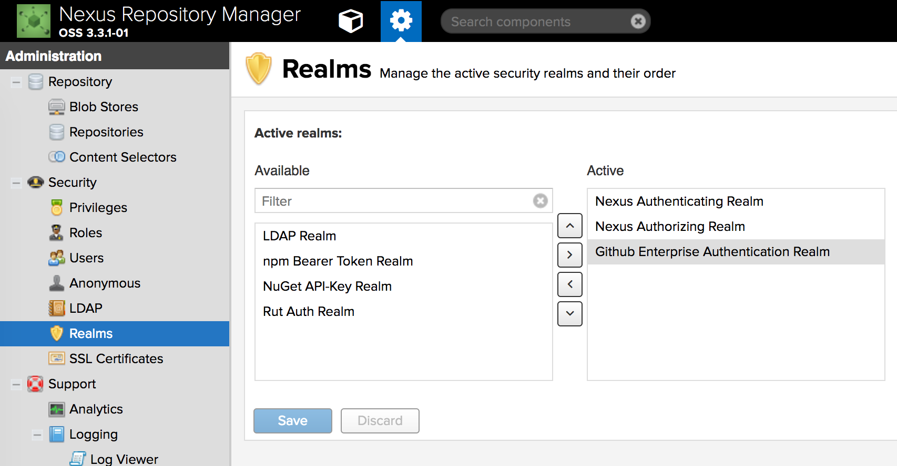

[](https://travis-ci.org/larscheid-schmitzhermes/nexus3-github-oauth-plugin)
[](https://www.codacy.com/app/jan_7/nexus3-github-oauth-plugin?utm_source=github.com&amp;utm_medium=referral&amp;utm_content=larscheid-schmitzhermes/nexus3-github-oauth-plugin&amp;utm_campaign=Badge_Grade)
# Nexus3 Github OAuth Plugin
This plugin adds a Github realm to Sonatype Nexus OSS and enables you to authenticate with Github Users and authorize with Github Orgs and Teams.

The plugin does not implement a full OAuth flow, instead you use your github user name + an OAuth token you generated in your account to log in to the nexus.
This works through the web as well as through tools like maven, gradle etc.

## Setup

#### 1. Activate the Realm
Log in to your nexus and go to _Administration > Security > Realms_. Move the Github Realm to the right. The realm order in the form determines the order of the realms in your authentication flow. We recommend putting Github _after_ the built-in realms:


#### 2. Group / Roles Mapping
When logged in through Github, all organizations and teams the user is a member of will be mapped into roles like so:

_organization name/team name_ e.g. `dummy-org/developers`

You need to manually create these roles in _Administration > Security > Roles > (+) Create Role > Nexus Role_ in order to assign them the desired priviliges. The _Role ID_ should map to the _organization name/team name_. Note that by default anybody is allowed to login (authenticate) with a valid Github Token from your Github instance, but he/she won't have any priviledges assigned with their teams (authorization) - see the config property `github.org` if you want to change that behaviour.


## Usage

The following steps need to be done by every developer who wants to login to your nexus with Github.
#### 1. Generate OAuth Token

In your github account under _Settings > Personal access tokens_ generate a new OAuth token. The only scope you need is **read:org**

#### 2. Login to nexus

When logging in to nexus, use your github user name as the username and the oauth token you just generated as the password.
This also works through maven, gradle etc.

## Installation

#### 0. Prerequisites

##### Directory naming convention:
For the following commands we assume your nexus installation resides in `/opt/sonatype/nexus`. See [https://books.sonatype.com/nexus-book/reference3/install.html#directories](https://books.sonatype.com/nexus-book/reference3/install.html#directories) for reference.

#### 1. Download and install

The following lines will:
- create a directory in the `nexus` / `kafka` maven repository
- download the latest release from github
- unzip the releae to the maven repository
- add the plugin to the `karaf` `startup.properties`.
```shell
mkdir -p /opt/sonatype/nexus/system/com/larscheidschmitzhermes/ &&\
wget -O /opt/sonatype/nexus/system/com/larscheidschmitzhermes/nexus3-github-oauth-plugin.zip https://github.com/larscheid-schmitzhermes/nexus3-github-oauth-plugin/releases/download/2.0.0/nexus3-github-oauth-plugin.zip &&\
unzip /opt/sonatype/nexus/system/com/larscheidschmitzhermes/nexus3-github-oauth-plugin.zip -d /opt/sonatype/nexus/system/com/larscheidschmitzhermes/ &&\
echo "mvn\:com.larscheidschmitzhermes/nexus3-github-oauth-plugin/2.0.0 = 200" >> /opt/sonatype/nexus/etc/karaf/startup.properties
```

#### 2. Create configuration
Create `/opt/sonatype/nexus/etc/githuboauth.properties`

Within the file you can configure the following properties:

|Property        |Description                              |[Default](https://github.com/larscheid-schmitzhermes/nexus3-github-oauth-plugin/blob/master/src/main/java/com/larscheidschmitzhermes/nexus3/github/oauth/plugin/configuration/GithubOauthConfiguration.java)|
|---             |---                                      |---    |
|`github.api.url`|URL of the Github API to operate against.|`https://api.github.com`|
|`github.principal.cache.ttl`|[Java Duration](https://docs.oracle.com/javase/8/docs/api/java/time/Duration.html#parse-java.lang.CharSequence-) for how long a given Access will be cached for. This is a tradeoff of how quickly access can be revoked and how quickly a Github user's rate limit will be reached for the Github User API. _Note:_ Github Enterprise does not have a rate limit!|`PT1M` (1 Minute)|
|`github.org`|The Organization the user should be a member of. If this is not set anyone with a Github account is allowed tot login.|----|

This is what an example file would look like:
```properties
github.api.url=https://github.example.com/api/v3 #note: no trailing slash!!!
github.principal.cache.ttl=PT1M
```

#### 3. Restart Nexus
Restart your Nexus instance to let it pick up your changes.

## Development
You can build the project with the integrated maven wrapper like so: `./mvnw clean package`

You can also build locally using Docker by running `docker run --rm -it -v $(pwd):/data -w /data maven:3.5.2 mvn clean package`

You can build a ready to run docker image using the [`Dockerfile`](Dockerfile) to quickly spin up a nexus with the plugin already preinstalled.

## Credits

The whole project is heavily influenced by the [nexus3-crowd-plugin](https://github.com/pingunaut/nexus3-crowd-plugin).
